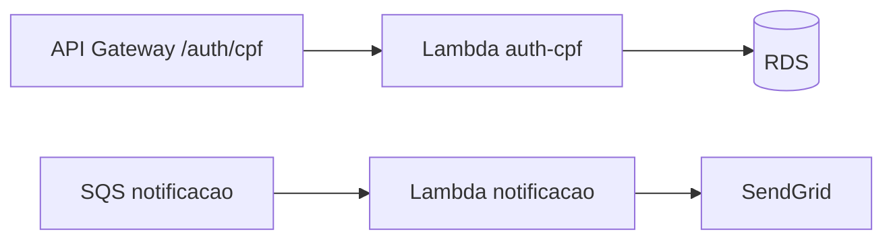

# tech-challenge-serverless

Functions AWS Lambda da oficina: autenticação de clientes por CPF e notificação de status de ordem de serviço.

## Propósito e limites

| Dentro deste repo | Fora deste repo |
| --- | --- |
| Código TypeScript das Functions `auth-cpf` e `notificacao` | Shell IAM/VPC/S3 das Lambdas → `tech-challenge-infra-kubernetes` |
| Build ZIP + upload S3 + update-function-code | API Gateway, filas, RDS → infra |
| Testes unitários e contratos em `docs/` | Schema Prisma e migrations → `tech-challenge-oficina` |

## Tecnologias

| Tecnologia | Versão |
| --- | --- |
| Node.js | 20+ |
| TypeScript | 5.7 |
| esbuild | 0.24 |
| pg | 8 |
| jsonwebtoken | 9 |
| Jest | 29 |

## Dockerfile

**Não aplicável.** Deploy via artefato ZIP (`{commit_sha}.zip`) no S3; runtime é Node.js gerenciado pela AWS Lambda, não container.

## Arquitetura (este repositório)



Visão completa: [diagrama componentes](https://github.com/7feeh7/tech-challenge-oficina/blob/main/docs/diagramas/componentes-nuvem.md) · Sequência auth: [sequencia-auth-cpf](https://github.com/7feeh7/tech-challenge-oficina/blob/main/docs/diagramas/sequencia-auth-cpf.md) · RFCs/ADRs: [rfcs](https://github.com/7feeh7/tech-challenge-oficina/tree/main/docs/rfcs), [adrs](https://github.com/7feeh7/tech-challenge-oficina/tree/main/docs/adrs)

## Functions

| Function | Trigger | Descricao |
| --- | --- | --- |
| `auth-cpf` | API Gateway `POST /auth/cpf` | Valida CPF, busca cliente no PostgreSQL e emite JWT |
| `notificacao` | SQS (spec 004) | Envia e-mail de mudanca de status |

Codigo provisionado (shell/IAM/VPC) em `tech-challenge-infra-kubernetes`. Este repositorio e a **fonte de verdade** do codigo das Functions.

## Estrutura

```text
src/
  functions/
    auth-cpf/handler.ts
    notificacao/handler.ts
  shared/
    services/     database (PostgreSQL), jwt
    validators/   cpf
    types/
tests/
.github/workflows/
```

## Pre-requisitos

- Node.js 20+
- npm 10+
- Infra kubernetes deployada (SSM + Lambda shell + bucket S3)

## Desenvolvimento local

```bash
npm ci
npm run lint
npm run type-check
npm test
npm run build
```

## Integracao cross-repo

Prefixo unico: `/tech-challenge/producao/`

| Parametro SSM | Uso |
| --- | --- |
| `infra/lambda_artifacts_bucket` | Upload ZIP `{sha}.zip` |
| `infra/lambda_auth_function_name` | Deploy auth-cpf |
| `infra/lambda_notificacao_function_name` | Deploy notificacao |
| `database/db_secret_arn` | Runtime da auth-cpf |

## GitHub Secrets (Environment `producao`)

| Secret | Uso |
| --- | --- |
| `AWS_ACCESS_KEY_ID` / `AWS_SECRET_ACCESS_KEY` | Upload S3 + update Lambda |

## Branches e pipelines

| Branch | Workflow | Toca AWS |
| --- | --- | --- |
| `develop` | `pr-validation.yml` | **nao** |
| `main` | `deploy.yml` | **sim** |

Artefatos usam tag imutavel `{commit_sha}.zip`; `latest.zip` e alias secundario.

## Rollback

1. Identifique a versao anterior no S3 (`lambda-auth-cpf/{sha-anterior}.zip`).
2. Execute `aws lambda update-function-code` apontando para o ZIP desejado.
3. Ou reverta o commit e faca merge na branch alvo.

Detalhes funcionais das Functions: specs `002` (auth) e `004` (notificacao).

## Repositórios relacionados

| Repositório | URL | Papel |
| --- | --- | --- |
| tech-challenge-oficina | https://github.com/7feeh7/tech-challenge-oficina | API NestJS, docs centrais, Swagger `/docs` |
| tech-challenge-infra-kubernetes | https://github.com/7feeh7/tech-challenge-infra-kubernetes | Provisiona Lambdas (shell), Gateway, SSM |
| tech-challenge-infra-database | https://github.com/7feeh7/tech-challenge-infra-database | RDS + secret consumido pela auth-cpf |

**Ordem de deploy:** infra-kubernetes (1º) → infra-database (2º) → **este repo** (3º) → aplicação (4º).

## Swagger / OpenAPI

**Não aplicável neste repositório** (sem API HTTP própria). Contratos:

- Auth: [`docs/contrato-auth-cpf.md`](docs/contrato-auth-cpf.md) — endpoint público `POST /auth/cpf` no Gateway
- API de negócio: [OpenAPI da aplicação](https://github.com/7feeh7/tech-challenge-oficina/blob/main/docs/openapi.json) · runtime `{api_gateway_url}/docs`

## Deploy ativo

Após merge em `main`, o workflow publica ZIP no bucket SSM `infra/lambda_artifacts_bucket` e atualiza as Functions. Endpoint de auth: `{api_gateway_url}/auth/cpf` (SSM `api_gateway_auth_url`).

## Contrato `POST /auth/cpf`

Documentacao completa em [docs/contrato-auth-cpf.md](docs/contrato-auth-cpf.md).

Resumo:

- Body: `{ "cpf": "000.000.000-00" }`
- Sucesso: `{ "accessToken", "tokenType": "Bearer", "expiresIn" }`
- Erros: `400` (body/CPF), `401` (nao autorizado), `500`
- JWT: `sub`, `tipo`, `perfil`, `iss`, `aud`, `iat`, `exp`, `jti` — sem PII
- Sem refresh token

### Variaveis locais

| Variavel | Descricao |
| --- | --- |
| `JWT_SECRET` | Segredo local (nunca igual ao provisionado) |
| `DB_SECRET_ARN` | Credenciais RDS |
| `JWT_ISSUER` / `JWT_AUDIENCE` | Claims padrao |
